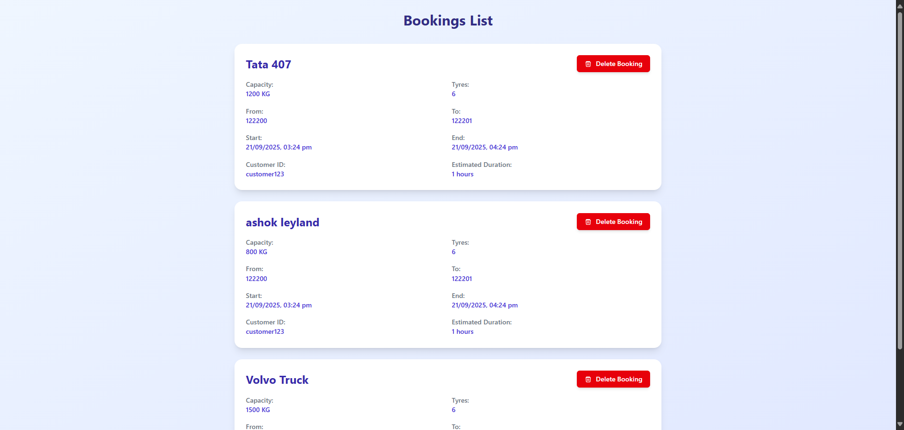
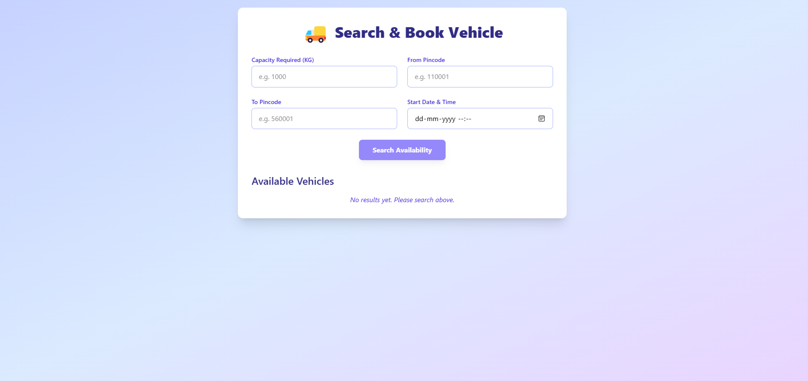

# Vehicle Booking System


---

## Project Overview

This is a full-stack vehicle booking application built with a **Node.js backend**, **React frontend**, and **MongoDB** database.

### see all Bookings


### search and book vehicle


### Objective

- **Backend:** Manage vehicles and bookings, calculate availability considering existing bookings and estimated ride times, and ensure data integrity.
- **Frontend:** Enable users to add vehicles, search for available vehicles based on capacity, route, and time, and book vehicles.
- **Testing:** Unit test critical backend logic including vehicle availability and booking conflict scenarios using Jest.

---

## Tech Stack

| Layer     | Technology                   |
|-----------|-----------------------------|
| Frontend  | ReactJS                     |
| Backend   | Node.js (Express)           |
| Database  | MongoDB                     |
| Testing   | Jest         |

---

## Features & API Endpoints

### Backend API

- **POST `/api/vehicles`**  
  Add a new vehicle  
  **Request body:**  
  ```json
  {
    "name": "Truck A",
    "capacityKg": 500,
    "tyres": 6
  }
